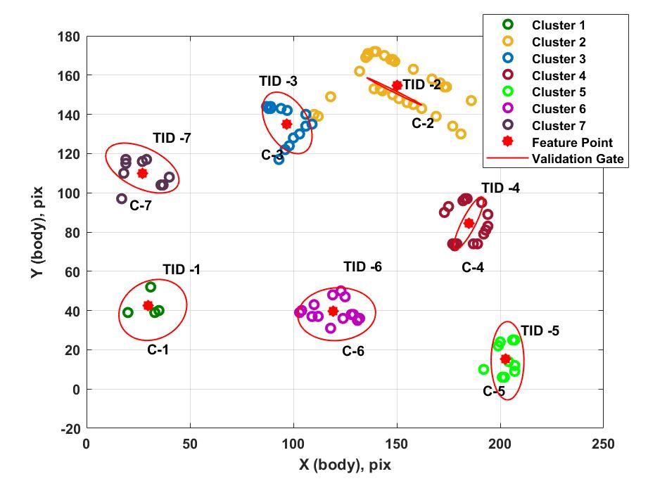
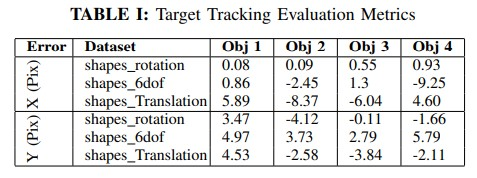

# Event Camera Based Multiple Target Tracking
This is a research project for ROB 590 Independent Study for Winter 2022 at the University of Michigan. The goal of this project is to perform Multiple Target Tracking for Event Camera Data. The work has been evaluated on 3 indoor datasets collected by the research group at the University of Zurich, for target tracking using event streams. 
## Installations
Clone the repository.
```
git clone git@github.com:rastri-dey/Event_Camera_MTT.git
mkdir Data
```
Download the dataset from https://rpg.ifi.uzh.ch/davis_data.html.
The dataset are available in zip format of text files. Convert the .txt files in MATLAB table format and save as .mat files indicated below:
```
Save "shapes_rotation.txt" as "events_shapes_rotation.mat"
Save "shapes_translation.txt" as "events_shapes_translation.mat"
Save "shapes_6dof.txt" as "events_shapes_6dof.mat"
```
Note the mat files should be in table format to read the event data. Run the main file.
```
Event_Camera_Multiple_Target_Tracking.m
```
## Discussion
The target trajectory for the 3 datasets has been evaluated and compared with the existing approach by the research group: https://ieeexplore.ieee.org/document/8593380?msclkid=a5bfd524bff011ec9414f0f574b704cf. Under all the 3 datasets from https://rpg.ifi.uzh.ch/davis_data.html, the event based tracking performs with high accuracy. The table shows the mean error of the target tracking for 4 objects in 3 different sequences executing varying motion dynamics in X and Y pixel coordinates. The trajectory plots with respect to ground truth are present in \images folder.
## Result
### Target Trajectory for Shapes_rotation sequence




## Acknowledgement
This research would not have been possible without the exceptional support of Professor Katie Skinner at the University of Michigan, Ann Arbor.
