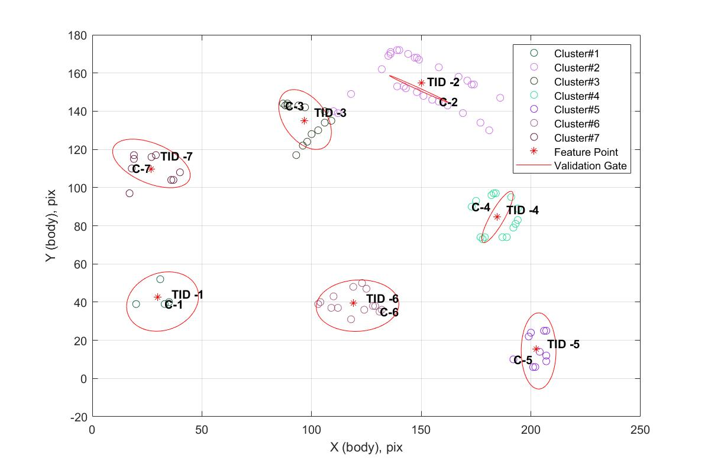
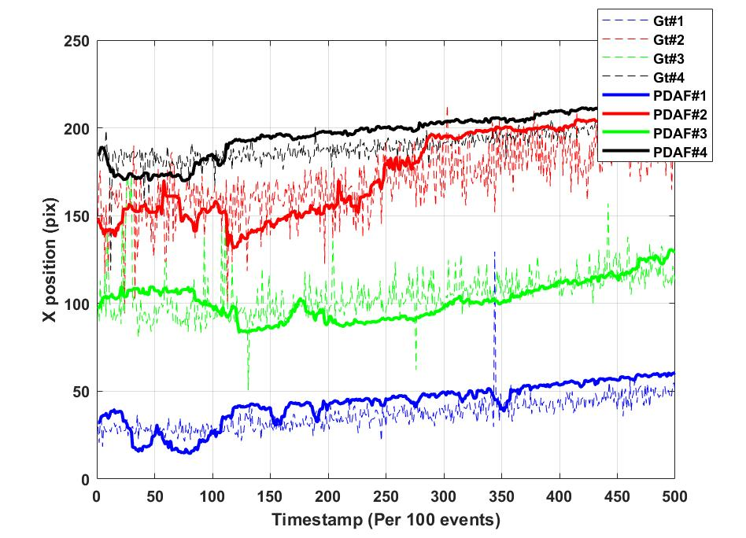

# Event_Camera_MTT
This is a research project for ROB 590 Independent Study for Winter 2022 at the University of Michigan. The goal of this project is to perform Multiple Target Tracking for Event Camera Data. The work has been evaluated on 3 indoor datasets collected by the research group at the University of Zurich, for target tracking using event streams. 
## Installations
Clone the repository
```
git clone git@github.com:
mkdir Data
```
Download the dataset from https://rpg.ifi.uzh.ch/davis_data.html
The dataset are available in zip format of text files. Convert the .txt files in MATLAB table format and save as .mat files indicated below:
```
Save "shapes_rotation.txt" as "events_shapes_rotation.mat"
Save "shapes_translation.txt" as "events_shapes_translation.mat"
Save "shapes_6dof.txt" as "events_shapes_6dof.mat"
```

## Result
### Target Trajectory for Shapes_rotation sequence



## Relevant Papers and Work
https://ieeexplore.ieee.org/document/8593380?msclkid=a5bfd524bff011ec9414f0f574b704cf
https://par.nsf.gov/servlets/purl/10189706?msclkid=c2d6bd1fbff011ec9c4fbcba0bf82255
https://ietresearch.onlinelibrary.wiley.com/doi/epdf/10.1049/trit.2019.0107?msclkid=e43304d4bff011ecae24a5ddf93eca70
Original Dataset: https://rpg.ifi.uzh.ch/davis_data.html

## Acknowledgement
Professor Katie Skinner for ROB 590 in Winter 2022.
